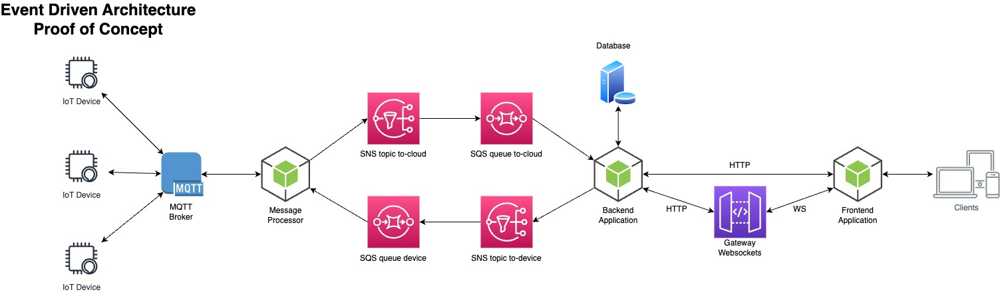

# Event-Driven Architecture - Proof of Concept



## Start Development Environment

Requirements:

- [NodeJS](https://nodejs.org/en/) > v18
- [NVM](https://github.com/nvm-sh/nvm)
- [Docker](https://www.docker.com/)
- [MQTT-Explorer](http://mqtt-explorer.com/) [useful but not mandatory]
- Terraform
- AWS CLI

```
nvm use 18.12.1
cd starter && ./start.sh

# Open Browser
open http://localhost:8030

# Start the mock device
cd mock-device && npm run dev
```

## Frontend

This service is the frontend application that will connect to the backend application (http and websockets), display device information and send remote actions to the device.

## Backend

This service is the backend application that will receive the messages from the message processor through SQS queue, and send remote actions to the SNS topic.

## Gateway Websockets

This service is responsible for handling the websocket connections (frontend application) and forward the messages to the backend service.

### Independent Usage

Connect to the websocket endpoint using [Websocket King client](https://websocketking.com/)

```
ws://localhost:9001/ws?deviceId=myDevice1234
```

Send a message to the websocket endpoint

```
POST http://localhost:9001/send
{
    "connectionId": "9215e3e1-fbb0-46f9-8a21-071fee6188c2",
    "payload": "{\"foo\":\"bar\"}"
}
```

## Message Processor

This service is a message processor that:

- Receive the messages from the IoT devices (MQTT) and send them to the SNS topic.
- Receive commands from the SQS queue and send them to the IoT device.
- Manage the connectivity status of the IoT devices (using the Last Will Testament funcionality of MQTT).

## MQTT Broker

The MQTT broker will be available on localhost:1883

## Mock Device

This service is a mock device that will connect to the MQTT broke, send events and receive commands from the MQTT broker.

### Configuration

The config file is in the file [mosquito.conf](./starter/volumes/mqtt/config/mosquitto.conf)

By default we activated the log and data persistance (logs are in the `starter/volumes/mqtt/log` folder, and data are stored in `starter/volumes/mqtt/data` folder).

### Authentication

The default user is `admin/password`.

**You always have to restart if you want the modification to be taken in account:**

```bash
docker compose restart
```

### Change user password / create a new user

```bash
docker compose exec mqtt-broker mosquitto_passwd -b /mosquitto/config/password.txt user password
```

### Delete user

```bash
docker compose exec mqtt-broker mosquitto_passwd -D /mosquitto/config/password.txt user
```

## Notes

- [SQS Admin](https://github.com/PacoVK/sqs-admin) UI for managing SQS-Queues for local development

- React app created with Vite

```
npm create vite@latest
```

- List SNS topics

```
aws --endpoint-url=http://localhost:4566 sns list-topics | cat
```

- List SQS queues

```
aws --endpoint-url=http://localhost:4566 sqs list-queues | cat
```

- List SNS subscriptions

```
aws --endpoint-url=http://localhost:4566 sns list-subscriptions | cat
```

- Websockets Endpoint

```
ws://localhost:9001/ws?deviceId=myDevice1234 (from host)
ws://gateway-ws:9001/ws?deviceId=myDevice1234 (from container)
```

- Localstack health endpoint

```
http://localhost:4566/\_localstack/health
```

- Send command message to SQS queue:

```
aws --endpoint-url=http://localhost:4566 sqs send-message --queue-url http://localstack:4566/000000000000/to-device-sqs-queue --message-body '{"Type": "Notification", "MessageId": "08efc4d6-8254-4404-9c24-b5b516ab5146", "TopicArn": "arn:aws:sns:eu-central-1:000000000000:to-device-sns-topic", "Message": "{\"command\":\"DISABLE_TELEMETRY\",\"command_version\":\"1.0\",\"json_command_rfc\":\"1.0\",\"command_id\":\"01H3FTJGBEVJYM23491RBJ6ADX\",\"producer\":\"backend\",\"sent_on\":1687379591534,\"parameters\":{\"id\":\"ANTONIOMARTINEZCUSTOMULID1\",\"payload\":{}},\"meta\":{\"service\":\"backend\",\"version\":\"1.0\",\"created_at\":1687379591534}}", "Timestamp": "2023-06-21T20:33:11.542Z", "SignatureVersion": "1", "Signature": "EXAMPLEpH+..", "SigningCertURL": "https://sns.us-east-1.amazonaws.com/SimpleNotificationService-0000000000000000000000.pem", "UnsubscribeURL": "http://localhost:4566/?Action=Unsubscribe&SubscriptionArn=arn:aws:sns:eu-central-1:000000000000:to-device-sns-topic:65825848-8292-4623-b416-307c62bbba48"}' | cat
```
